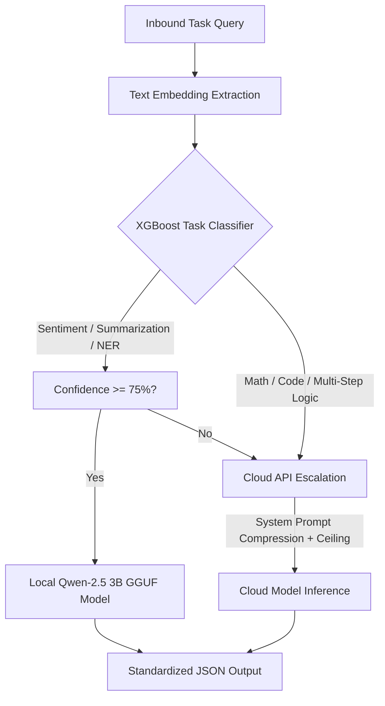

# AMD Developer Hackathon: Cost-Optimized AI Model Router

> Two-tier model routing engine combining offline XGBoost classification, local GGUF inference, and cloud API fallback to optimize execution cost and inference latency.

[](https://python.org/)
[](Dockerfile)
[](LICENSE)

---

## Overview

Running large language model inference across high-volume task queues creates significant API cost and latency bottlenecks. Many lightweight classification, sentiment, and structured extraction queries do not require multi-billion parameter cloud models.

This project implements a **two-tier cost-optimized model routing engine**:
1. **Tier 1 (Offline Routing & Local Inference)**: Evaluates task embeddings using an offline XGBoost classifier. Tasks with high confidence and low complexity (sentiment, factual lookups, structured extraction) run locally on a quantized Qwen-2.5 3B GGUF model ($0.00 API cost).
2. **Tier 2 (Cloud Escalation & Compression)**: Tasks requiring complex mathematical reasoning, code execution, or multi-step logic are dynamically routed to cloud LLM providers (e.g. Fireworks API) with compressed system prompts and strict token ceilings.

---

## Routing Architecture


```mermaid
graph TD
    A[Inbound Task Query] --> B[Text Embedding Extraction]
    B --> C{XGBoost Task Classifier}
    
    C -->|Sentiment / Summarization / NER| D[Confidence >= 75%?]
    D -->|Yes| E[Local Qwen-2.5 3B GGUF Model]
    D -->|No| F[Cloud API Escalation]
    
    C -->|Math / Code / Multi-Step Logic| F
    
    E --> G[Standardized JSON Output]
    F -->|System Prompt Compression + Ceiling| H[Cloud Model Inference]
    H --> G
```

---

## Resource Constraints & Concurrency Model

- **CPU Ceiling**: Configured for `n_threads=2` to respect strict vCPU limits.
- **Memory Management**: Serializes local GGUF execution with an asynchronous `Semaphore(1)` to operate safely within a 4 GB RAM envelope.
- **Timeout Isolation**: Enforces explicit per-task HTTP timeouts to prevent queue stalls during cloud API outages.

---

## Repository Structure

```
.
├── backend/                  # Routing engine and provider client logic
├── frontend/                 # Local evaluation UI
├── input/                    # Task queue inputs
├── output/                   # Formatted evaluation outputs
├── judge_evaluator.py        # Automated test harness and routing simulator
├── Dockerfile                # Container build specification
├── docker-compose.yml        # Multi-service test environment
└── README.md
```

---

## Getting Started

### Prerequisites
- Python 3.10 or higher
- Docker

### Running Locally

1. **Clone the repository**:
   ```bash
   git clone https://github.com/HamzaKhanBUIC/amd-developer-hackathon-track1.git
   cd amd-developer-hackathon-track1
   ```

2. **Run the local evaluation simulation**:
   ```bash
   python judge_evaluator.py
   ```

3. **Build and test with Docker**:
   ```bash
   docker build -t amd-router .
   docker run --rm -v $(pwd)/input:/app/input -v $(pwd)/output:/app/output amd-router
   ```

---

## Output Format

The router outputs strict standardized JSON:
```json
[
  {
    "task_id": "task-001",
    "answer": "Extracted response content",
    "tier_used": "local_gguf",
    "execution_time_ms": 142
  }
]
```

---

## License

This project is licensed under the MIT License. See [LICENSE](LICENSE) for details.
